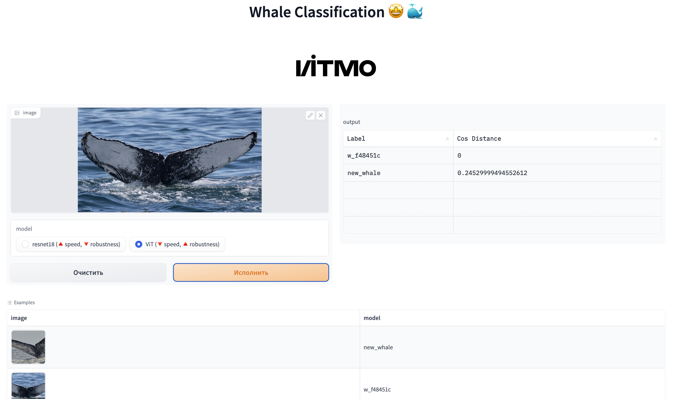

# Whale Classification

## Overview

Задача представляет собой [kaggle-соревнование](https://www.kaggle.com/competitions/humpback-whale-identification/overview) по классификации китов на изображениях.

**Цель работы:** решить данную задачу, используя подход `mertic learning`, а также разработать демо-сервис для инференса изображений.

## Project

Репозиторий имеет следующую структуру:
* `api` - папка, содержащая реализацию демо-сервиса (более подробная информация по запуску сервиса находится ниже)
  * `examples` - папка с подготовленными примерами для инференса
  * `models` - в данной папке находятся все необходимые компоненты для инференса (модели для получения эмбеддингов, knn, label encoder и др.)
  * `app.py` - скрипт запуска веб-сервиса
* `data` - папка, где необходимо расположить данные `train, test, train.csv`
* `experiments` - папка для локального логгирования артефактов обучения (создается автоматически при последовательном запуске пайплайна обучения) 
* `src` - скрипты для преобработки данных, обучения моделей, рассчета метрик, обучения knn, получения эмбеддингов и создания сабмита (submission.csv)
* `config.py` - конфиг-класс, где задаются параметры обучения

## Dataset

Датасет состоит из двух папок с изображениями китов:
* train - 25361 изображений
* test - 7960 изображений

Также приложен файл `train.csv`, который содержит информацию о классе кита на каждом изображении. Всего в наборе данных представлено **5005 уникальных видов китов**, из которых обнаружено:
* чаще всего встречается класс `new_whale`- 9664 из 25361 изображений
* 2073 класса содержат только одно изображение

Для обучения и валидации пайплайна набор данных был разделен на две части, причем в обучающую выборку вошли:
* все классы (2073 класса), содержащие только одно изображение на класс;
* 7731 изображений из класса new_whale, остальные 1933 - в валидационную выборку;
* все остальные классы были разделены с помощью метода StratifiedKFold (тут понял, что ошибся, так как изображения разделились поровну между train и val выборками - 2931 уникальных классов по 6812 изображений на выборку).

## Models

К настоящему времени в качестве энкодеров для получения эмбеддингов были опробованы следующие модели:
* непредобученный `resnet18` из torchvision;
* предобученный `ViT` (Visual Transformer) из hugging-face (веса - `google/vit-base-patch16-224`)

На выходе каждой модели получал **эмбеддинг размера 512**.

## Losses

В качестве лоссов использовал реализации из библиотеки `pytorch-metric-learning`. Были опробованы два лосса:
* ArcFace
* ProxyAnchorLoss

Забегу наперед и скажу, что лучше всего себя показали модели, обученные с помощью ProxyAnchorLoss.

## Pipeline

Для запуска всего пайплайна от обработки данных до создании сабмишн-файла нужно придерживаться следующей последовательности:
1. Запускаем `splits.py` для разделения данных на `train_split.csv` и `val_split.csv`.
2. Указываем в `config.py` необходимые параметры обучения.
3. Запускаем `train.py` для обучения модели. Получаем чекпоинты в папке `experiments/{LOSS_NAME}/{MODEL_NAME}`.
4. С помощью `embeddings.py` получаем эмбеддинги для каждого изображения из папки train (сохраняются также в `experiments/{LOSS_NAME}/{MODEL_NAME}` в numpy-формате `.npy`).
5. Обучаем с помощью `knn.py` классификатор для поиска наиближайших эмбеддингов. Сохраняем модель в `experiments/{LOSS_NAME}/{MODEL_NAME}` для последующего использования.
6. Запускаем `submission.py` для получения submission.csv.
7. Делаем сабмит на платформу: `kaggle competitions submit -c humpback-whale-identification -f experiments/proxy/ViT/knn_submission.csv -m "vit knn submission"`.

## Experiments

В качестве метрики качества на валидации использовалась метрика Recall: R@1, R@2, R@4, R@8, R@16, R@32.

Со временем в пайплайн обучения было добавлено логгирование метрик в WandB. Ссылка: https://wandb.ai/cv-itmo/whale_classification?workspace=user-dmitryai

Результаты основных экспериментов приведены в таблице ниже (было проведено еще несколько, но они не указаны в связи неуспешности).

| **Модель** | **R@1** | **Leaderboard Score** |
|----------------|:---------|:----------------|
| resnet18_arcface | 0.104 | - |
| resnet18_proxy | 0.105 | 0.20022 |
| vit_proxy | 0.304 | **0.40347** |

Результаты показывают, что на данный момент лучше всех себя продемонстрировал ViT в связке с ProxyAnchorLoss.

## Web API

Для реализации веб-сервиса был использован фреймворк `Gradio` ([ссылка на репозиторий](https://github.com/gradio-app/gradio)), который позволяет реализовывать веб-приложения для демо-решений и production систем.

Веб-сервис позволяет опробовать две модели: `resnet18_proxy` и `vit_proxy`.

Для запуска веб-сервиса необходимо скачать архив ([ссылка на гугл-диск](https://drive.google.com/file/d/1NBph6h8somnUr5nZk8jwLYotbYryhE2v/view?usp=share_link)) с необходимыми артефактами и моделями и распаковать его в папке `api/models/`. 

Запуск производится из корня репозитория командой `python api/app.py`.

Перед этим возможно потребуется исполнение команды `export PYTHONPATH="${PYTHONPATH}":pwd`.

В левой части можно загрузить изображение для инференса или выбрать из примеров ниже, где также указаны классы изображений. Справа выводится результирующая таблица с топ-5 ближайшими классами и минимальным косинусным расстоянием.

## ToDo

Изначально был опробован пайплайн, реализованный только с помощью компонент библиотеки pytorch-metric-learning, однако он давал низкие метрики, в следствие чего пайплайн был переписан с самостоятельной реализацией обучающего цикла и др.

В один момент были трудности с обучением ViT, так как пайплайн был изначально реализован под resnet, поэтому потребовалось внесение изменений в обучающий цикл и подсчет метрики Recall.

Также было опробовано два подхода к непосредственной классификации изображений:
* обучение эмбеддингов с помощью knn для получения k-ближайших соседей;
* усреднение эмбеддингов изображений по классам и поиск ближайшего класса путем расчета косинусного расстояния между инференсным изображением и base-файлом с усредненными векторами. Однако данный подход не зашел и показал практически нулевой скор на лидерборде (возможно, стоит более детально проверить этот пайплайн).

Что можно сделать еще:
* эксперименты с моделями и лоссами;
* эксперименты с knn;
* поправить разделение данных на train и val;
* отрефакторить код.

